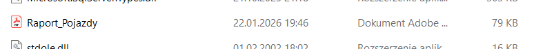

# 🚗 Ewidencja Pojazdów

Projekt zaliczeniowy realizujący aplikację w dwóch technologiach: desktopowej (Windows Forms) oraz webowej (HTML/Bootstrap/JS).

## 📸 Podgląd Aplikacji

### Wersja Webowa (Etap 3 i 4)
Strona internetowa z responsywnym interfejsem Bootstrap, obsługą modali i dynamiczną tabelą JS.

### Wersja Desktopowa (Etap 1 i 2)
Aplikacja okienkowa z bazą lokalną, systemem raportowania RDLC i eksportem do PDF.

---

## 📝 Opis Projektu

Projekt został zrealizowany w czterech etapach, pokrywając pełen zakres wymagań: od formularzy okienkowych po interaktywną stronę www.

### ✅ Zakres funkcjonalności:

#### 🖥️ Część Desktopowa (.NET WinForms)
* **Formularz ewidencji:** Dodawanie pojazdów (Nr rejestracyjny, Marka, Model, Rok, Data przeglądu).
* **Raportowanie:** Generowanie raportu "Pojazdy z przeglądem w bieżącym miesiącu" przy użyciu **ReportViewer**.
* **Eksport danych:** Możliwość zapisu wygenerowanego raportu bezpośrednio do pliku **PDF**.
* **Logika biznesowa:** Filtrowanie danych przy użyciu LINQ.

#### 🌐 Część Webowa (HTML5 + Bootstrap 5)
* **Nowoczesny UI:** Responsywna tabela i formularze stylowane biblioteką **Bootstrap 5**.
* **CRUD Frontend:** Dynamiczne dodawanie i usuwanie wierszy z tabeli przy użyciu **JavaScript**.
* **Walidacja:** Zabezpieczenie przed wprowadzaniem błędnych danych (np. rok spoza zakresu, puste pola).
* **Interaktywność:** Formularz dodawania pojazdu umieszczony w oknie modalnym (pop-up).

---

## 🛠️ Użyte Technologie

* **Języki:** C#, JavaScript, HTML5, CSS3
* **Frameworki/Biblioteki:** .NET Framework (WinForms), Bootstrap 5
* **Narzędzia:** Visual Studio 2022, Visual Studio Code, Git & GitHub
* **Raportowanie:** Microsoft RDLC Report Designer, ReportViewer

---

## 🚀 Jak uruchomić projekt

### Aplikacja Desktopowa
1.  Pobierz repozytorium.
2.  Otwórz plik `EwidencjaPojazdow.sln` w Visual Studio.
3.  Uruchom projekt przyciskiem **Start**.

### Aplikacja Webowa
1.  Wejdź do folderu `Web`.
2.  Otwórz plik `index.html` w dowolnej przeglądarce internetowej.

---

*Projekt wykonany w ramach zaliczenia przedmiotu: Projektowanie interfejsów użytkownika .*
